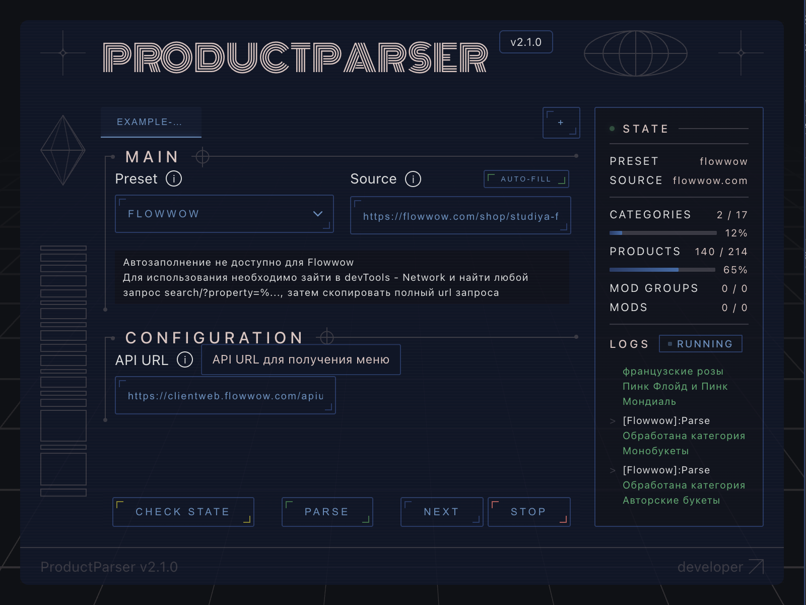
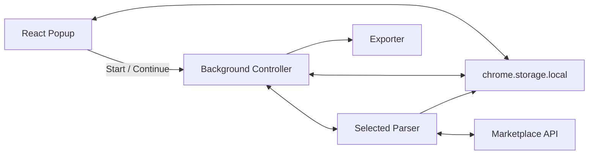
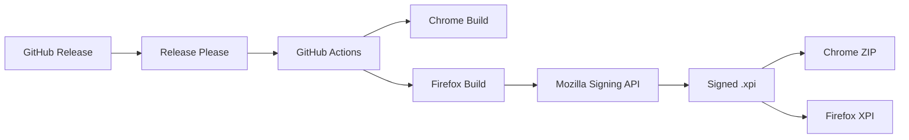

Русский | [English](./docs/README.en.md)

<div align="center">

<h1 align="center"> ProductParser</h1>

### Универсальное расширение для браузера, позволяющее извлекать каталоги товаров из маркетплейсов


> Модульное • Реактивное • Расширяемое

</div>

---

<p align="center">


</p>

---

## Описание

ProductParser - это расширение для браузера с открытым исходным кодом, предназначенное для извлечения каталогов товаров из различных онлайн-сервисов в единый формат экспорта (XML).

ProductParser автоматически собирается для Google Chrome и Mozilla Firefox. Каждая новая версия сопровождается созданием готовых установочных файлов для обоих браузеров, а Firefox-версия автоматически подписывается через Mozilla Add-ons API в процессе CI/CD.

В отличие от традиционных одноразовых парсеров, ProductParser построен на модульной архитектуре, где каждый маркетплейс использует один и тот же интерфейс парсинга, разделяя при этом общий процесс обработки.

Цель проекта - упростить добавление поддержки новых маркетплейсов без изменения основного приложения.

---

## Особенности проекта

- единая архитектура парсеров;
- поддержка нескольких маркетплейсов;
- React + TypeScript;
- Manifest V3;
- Google Chrome и Mozilla Firefox;
- полностью автоматизированный CI/CD;
- автоматическое формирование релизов;
- автоматическая подпись Firefox-сборок;
- готовые к установке релизные артефакты.

---

## Почему ProductParser?

ProductParser упрощает периодическое извлечение данных о товарах и позволяет одним щелчком мыши обновлять каталог.

Это дает возможность:

- поддерживать несколько сервисов
- повторно использовать один и тот же конвейер экспорта
- внедрять новые интеграции с минимальными изменениями

---

# Функции

- Модульная архитектура парсера
- Состояние парсера в реальном времени
- Пошаговый режим парсинга
- Автоматическая настройка (где поддерживается)
- Ручная настройка для сложных API
- Единый формат экспорта в XML
- Логирование в реальном времени
- Манифест V3
- Пользовательский интерфейс React
- Поддержка Google Chrome и Mozilla Firefox
- Автоматическая проверка обновлений
- Автоматическая сборка релизов
- Автоматическая подпись Firefox-версии
- Release Please

---

# Поддерживаемые сервисы

| Сервис | Статус | Автозаполнение |
|----------|--------|-----------|
| VK | ✅ | ✅ |
| Yandex Food | ✅ | ✅ |
| Delivery Club | ✅ | ✅ |
| Yandex Maps *(частично)* | ✅ | ✅ |
| Chibbis | ✅ | ✅ |
| Kuper | ✅ | ❌ |
| Flowwow | ✅ | ❌ |
| WhatsApp Catalog | ✅ | ❌ |
| Custom | 🚧 | Запланировано |

---

# Интерфейс

Интерфейс намеренно избегает внешнего вида типичного расширения для браузера.

Он вдохновлён ретрофутуристическими операционными системами и инструментами разработчика, где каждое действие парсера, переход состояния и сообщение журнала отображаются в реальном времени.

<p align="center">



</p>

---

# Архитектура



### Принципы проектирования

- Всплывающее окно не содержит логики парсинга.
- Процесс парсинга контролируется фоном.
- Каждый маркетплейс изолирован в собственном парсере.
- Общее состояние синхронизируется через `chrome.storage.local`.
- Пользовательский интерфейс реагирует на состояние, а не управляет им.

---

# Установка

## Для пользователей

Загрузите последнюю сборку из **Releases**.

### Chrome
```
Releases
    ↓
Загрузите zip архив
    ↓
chrome://extensions
    ↓
Developer Mode
    ↓
Загрузите распакованный архив
```

### Firefox
```
Releases
    ↓
Загрузите .xpi файл
    ↓
Браузер сразу предложит установить расширение
```

Готово

---

## Для разработчиков

Клонируйте репозиторий
```bash
git clone https://github.com/SamuelGambino/extention-react.git
```

Установите зависимости
```bash
npm i
```

Разработка
```bash
npm run dev
```

Сборка для chrome и firefox
```bash
npm run build
```

Отдельные сборки
```bash
npm run build:chrome

npm run build:firefox
```

Затем загружайте собранное расширение из директории `dist`

---

# Структура проекта
```
background/
```
Основная логика парсинга, контроллер парсера и экспортер

```
popup/
```
React приложение

```
content/
```
Пока не используется

```
globalTypes/
```
Общие типы

---

# Создание парсера

Каждый парсер для маркетплейса наследует один и тот же базовый класс

```ts
class NewMarketplaceParser extends BaseParser {}
```

Создайте модуль парсера и реализуйте необходимые методы

Кроме разработки модуля портебуется добавить его значение для вызова модуля в background/index.ts
Добавить тип в globalTypes/parser_config.ts
Добавить значение в выпадающий список в popup/Form/constants.ts
И соответственно определить необходимые поля для заполнения конфигурации в popup/Form/blocks/ConfigurationBlock.tsx

При желании и возможности можно добавить автозаполнение конфигурации в popup/hooks/useAutoFill.ts

---

# Процесс парсинга

```
Пользователь
↓
Конфигурация
↓
Запрос(ы) к api маркетплейса
↓
Метаданные
↓
Парсинг продуктов/категорий
↓
Экспорт
```

Парсер может по желанию приостанавливать работу после каждого этапа

Этот режим в первую очередь предназначен для отладки, разработки парсеров и анализа API

---

# CI/CD

Каждый новый релиз автоматически проходит полный цикл публикации:

- обновление версии через Release Please;
- синхронизация версии во всех manifest-файлах;
- сборка Chrome-версии;
- сборка Firefox-версии;
- автоматическая подпись Firefox через Mozilla AMO API;
- публикация готовых артефактов на GitHub Releases.

В результате каждый релиз содержит:

- Chrome (.zip)
- Firefox (.xpi)



---

# Roadmap

- [x] Модульная архитектура парсера
- [x] Экспортер
- [x] VK
- [x] Yandex
- [x] Chibbis
- [x] Kuper
- [x] Flowwow
- [x] WhatsApp
- [x] Кроссбраузерная поддержка (Chrome / Firefox)
- [x] Автоматическая подпись Firefox
- [x] Автоматические GitHub Releases
- [ ] Универсальный модуль парсера
- [ ] Локализация
- [ ] Автотесты

---

# Contributing

Pull Requests приветствуются

Если вы хотите добавить поддержку нового маркетплейса, пожалуйста, создайте заявку (Issues) перед началом работы

Форкните или дайте звезду - тоже будет приятно :)

---

# License

[MIT](./LICENSE)
