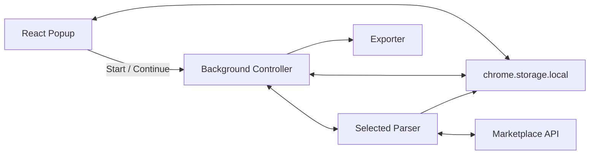

[Русский](../README.md) | English

<div align="center">

<h1 align="center"> ProductParser</h1>

### Universal browser extension for extracting product catalogs from online marketplaces


> Modular • Reactive • Extensible

</div>

---

<p align="center">


</p>

---

## Overview

ProductParser is an open-source browser extension designed to extract product catalogs from multiple online services into a unified export format (XML).

Unlike traditional one-off parsers, ProductParser is built around a modular architecture where every marketplace implements the same parsing interface while sharing a common parsing pipeline.

The goal of the project is to make adding support for new marketplaces simple without changing the core application.

---

## Why ProductParser?
 
ProductParser makes periodic product extraction effortless and regular catalog updates a matter of a single click.

This makes it possible to:

- support multiple services
- reuse the same export pipeline
- implement new integrations with minimal changes

---

# Features

- Modular parser architecture
- Real-time parser state
- Step-by-step parsing mode
- Automatic configuration (where supported)
- Manual configuration for complex APIs
- Unified export format in XML
- Live logging
- Manifest V3
- React UI

---

# Supported Services

| Service | Status | Auto-fill |
|----------|--------|-----------|
| VK | ✅ | ✅ |
| Yandex Food | ✅ | ✅ |
| Delivery Club | ✅ | ✅ |
| Yandex Maps *(partial)* | ✅ | ✅ |
| Chibbis | ✅ | ✅ |
| Kuper | ✅ | ❌ |
| Flowwow | ✅ | ❌ |
| WhatsApp Catalog | ✅ | ❌ |
| Custom | 🚧 | Planned |

---

# Interface

The interface intentionally avoids the appearance of a typical browser extension.

It is inspired by retro-futuristic operating systems and developer tools where every parser action, state transition and log message is visible in real time.

<p align="center">


</p>

---

# Architecture



### Design Principles

- Popup contains no parsing logic.
- Background owns the parsing pipeline.
- Every marketplace is isolated in its own parser.
- Shared state is synchronized through `chrome.storage.local`.
- UI reacts to state instead of controlling it.

---

# Installation

## For Users

Download the latest build from **Releases**.
```
Releases
    ↓
Extract archive
    ↓
chrome://extensions
    ↓
Developer Mode
    ↓
Load unpacked
```

Done

---

## For Developers

Clone repository
```bash
git clone https://github.com/SamuelGambino/extention-react.git
```

Install dependencies
```bash
npm i
```

Development
```bash
npm run dev
```

Production build
```bash
npm run build
```

Then load the generated extension from the `dist` directory

---

# Project Structure
```
background/
```
Core parsing logic, parser controller and exporter

```
popup/
```
React application

```
content/
```
Not in use yet

```
globalTypes/
```
Shared application types

---

# Creating a Parser

Every marketplace parser extends the same base class

```ts
class NewMarketplaceParser extends BaseParser {}
```

Create a parser module and implement the necessary methods

In addition to developing the module, you need to add its value for calling the module in background/index.ts
Add the type to globalTypes/parser_config.ts
Add the value to the drop-down list in popup/Form/constants.ts
And define the required fields for filling in the configuration in popup/Form/blocks/ConfigurationBlock.tsx

If desired and possible, you can add configuration autofill in popup/hooks/useAutoFill.ts

---

# Parsing Pipeline

```
User
↓
Configuration
↓
Marketplace validation
↓
Metadata
↓
Products
↓
Categories
↓
Export
↓
Completed
```

The parser may optionally pause after every stage

This mode is primarily intended for debugging, parser development and API inspection

---

# Roadmap

- [x] Modular parser system
- [x] Exporter
- [x] VK
- [x] Yandex
- [x] Chibbis
- [x] Kuper
- [x] Flowwow
- [x] WhatsApp
- [ ] Firefox support
- [ ] Custom parser constructor
- [ ] Localization
- [ ] Automated tests

---

# Contributing

Pull Requests are welcome.

If you would like to implement support for a new marketplace, please open an Issue before starting work.

Fork or give a star - that would be nice too :)

---

# License

MIT
